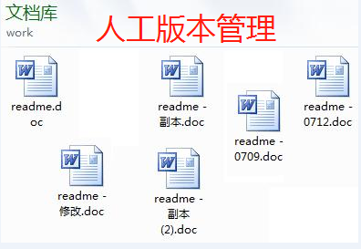
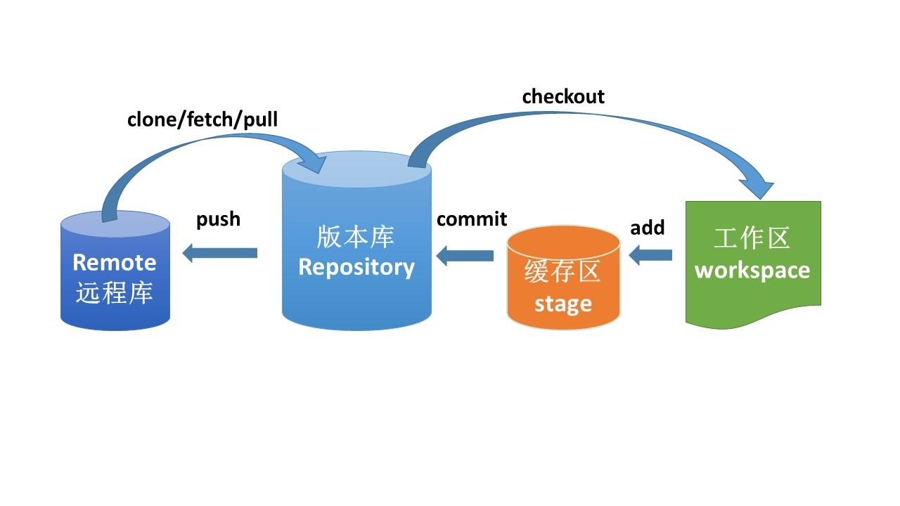
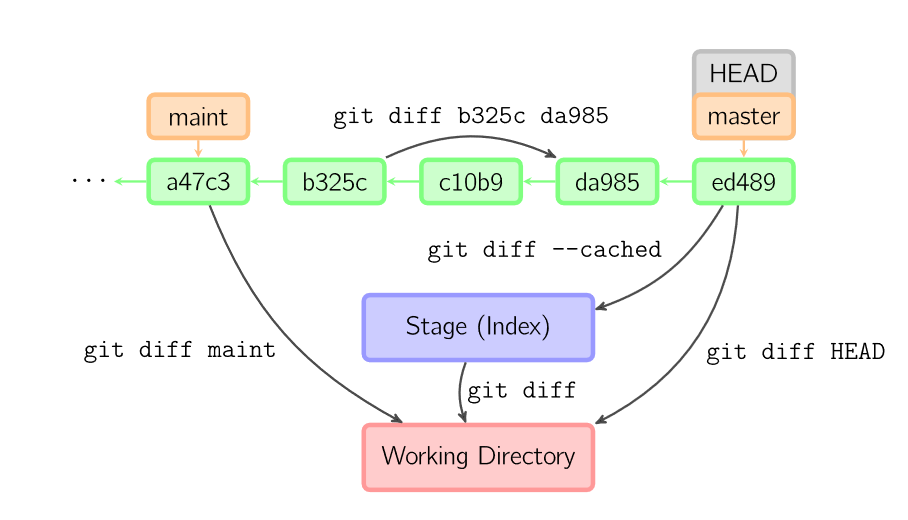

# 30分钟吃掉Git和Github版本管理


### 一，GitHub是什么


GitHub是一个非常流行的全球代码托管平台，基于Git版本控制技术实现，同时GitHub也是一个活跃的开发者交流社区。许多的开源项目都在GitHub上发布。例如著名的Linux操作系统内核的源代码。


### 二，Git是什么

Git是目前世界上最先进的分布式版本控制系统（没有之一）。

它由Linux系统之父Linus Torvalds在2005年用C语言开发。

Git是一个分布式版本控制系统，没有中央服务器，不同于svn等需要中央服务器的集中式版本控制系统。

Git的功能：版本控制（版本管理，远程仓库，分支协作）


**人工版本管理：**





**Git版本管理：**


### 三，Git功能原理


* git版本控制系统由工作区，缓存区，版本库组成。
* git跟踪的是文件的修改而不是全部文件。
* git擅长管理代码等文本文件，不擅长管理图片等二进制文件。





### 四，快速上手

<!-- #region -->
1，安装Git

下载位置: [Git下载链接](https://git-scm.com/downloads)—— https://git-scm.com/downloads

可以在bash中执行git命令，也可以在Jupyter Notebook中执行.

2，配置用户信息

```bash
git config --global user.name "XX"
git config --global user.email "XX@XX"
```

3，新建文件夹并切入

```bash
mkdir git-learn
cd git-learn
```

4，创建仓库

```bash
git init
```

5，新建readme.txt

```bash
echo "hello world" >>readme.txt
```

6，查看当前状态：

```bash
git status
```

7，添加全部修改到暂存区并提交

```bash
git add -A
git commit -m"comment" 
```

8，添加github远程库并推送文件

```bash
git remote add origin https://github.com/XX/XX
git push -u origin master
```

9，在github上的项目clone到本地文件

```bash
git clone https://github.com/XX/XX  ../XX
```
<!-- #endregion -->

```python

```

<!-- #region -->
### 五，安装配置

命令列表：

* config(配置信息)
* init(创建仓库)
* help(帮助信息)
* status(当前状态)

特殊文件：

* .gitignore过滤文件(配置git无需管理的目录和文件)


示范1：基本配置

```bash
#设置用户名：
git config --global user.name "XXX"
#设置用户邮箱：
git config --global user.email "XXX@XX"
#初始化仓库
git init 
```

示范2：获取帮助

```bash
#获取常用git命令列表：
git help
#查看当前状态，获取提示：
git status
```


示范3：建立.gitignore过滤配置文件

```bash
#过滤掉.DS_store文件
echo ".DS_store" >.gitignore
#过滤掉.ipynb_checkpoints目录
echo ".ipynb_checkpoints/" >> .gitignore
#过滤掉所有zip文件
echo "*.zip" >>.gitignore 
```
<!-- #endregion -->

```python

```

<!-- #region -->
### 六，版本管理

命令列表：

* add(修改暂存)
* commit(提交修改)
* reset(版本回退)
* checkout(撤销修改)
* rm(删除文件)
* diff(比较文件)
* log(版本列表)
* reflog(版本历史)

git reset的说明：

```bash
git reset HEAD^ #可以回退到上一个版本。
git reset HEAD^^ #可以回退到上上个版本。
git reset a234b3 #可以回退到版本号为 a234b3的版本。
git reset --hard  head^   #修改版本库，修改暂存区，修改工作区
git reset --mixed head^  #修改版本库，修改暂存区，保留工作区
git reset --soft  head^  #修改版本库，保留暂存区，保留工作区
```

示范1：版本提交

```bash
echo "hello world" >>readme.txt
git add readme.txt
git add -A
git commit -m"add readme.txt"
#修改覆盖上一次commit:
git commit --amend
#先暂存再提交：
git commit -a -m"modify readme.txt"
```

示范2：版本回退
```bash
git reset --hard head^
git reset head a23b5
#撤销修改：
git checkout -- readme.txt
#图形显示仓库版本及分支状态：
git log --oneline --graph --all
#查看head指向过的版本历史：
git reflog
```

示范3：日志压缩
```bash
git reset --soft a23b5 #版本库回退到某个版本，工作区保留修改
git commit -m 'add feature' #将工作区的修改写到版本库中，a23b5到当前的日志被删除
```

示范4：撤销修改
```bash
echo "hello Haidian">>readme.txt
git checkout -- readme.txt #使用暂存区内容覆盖文件
```

示范5：版本对比

```bash
#查看工作区文件与暂存区文件区别：
git diff  readme.txt
#查看工作区文件和head文件区别：
git diff --head readme.txt
#查看暂存区文件与head文件区别：
git diff --cached readme.txt
#查看两个版本某一文件的区别:
git diff a458b d23e5 -- readme.txt
```



<!-- #endregion -->

```python

```

<!-- #region -->
### 七，远程仓库

命令列表：
* remote(设置远程)
* push(推送远程)
* clone(克隆远程)
* pull(合并远程)
* fetch(拉取远程)


远程仓库说明：

```bash
#通常可以用SSH协议和远程库通信或使用http协议和远程库通信。
#http协议较为方便，但SSH协议方式速度较快。
#运行下面命令，并一路回车，在用户主目录里找到.ssh目录。
ssh-keygen -t rsa -C "your_emial@xxx.com"
#目录下的id_rsa有私钥，不能泄露出去。里面的id_rsa.pub是公钥，可分享给别人。
#在GitHub——> settings ——> SSH Keys 页面添加SSH公钥。
#将公钥绑定github后尝试建立SSH连接:
ssh -T git@github.com
```

示范1：添加远程

```bash
#使用ssh地址添加github远程库连接并命名为github，ssh方式更稳定快速，但稍麻烦：
git remote add github git@github.com:lyhue1991/ai.git:
#使用url地址添加远程库，url方式更简单：
git remote add origin https://github.com/lyhue1991/GitHub.git
```

示范2：推送到远程

```bash
#推送本地至远程库origin的master分支:
git push -u origin master
#查看远程库信息：
git remote -v
#移除和远程库的连接:
git remote remove orgin
```

示范3：拉取远程

```bash
#建立当前master分支与远程库develop分支的追踪关系：
git branch --set-upstream master origin/develop
#将远程仓库克隆到本地父目录的ML文件夹：
git clone https://github.com/lyhue1991/machine-learning.git ../ML

#取回origin的develop分支与当前master分支合并(或会冲突)：
git pull orgin/develop:master

#获取origin的develop分支到本地并用merge合并(pull≈fetch+merge)：
git fetch origin develop
git merge origin/develop  
```
<!-- #endregion -->

```python

```

<!-- #region -->
### 八，分支协作

命令列表：
* branch(设置分支)
* checkout(切换分支)
* merge(合并分支)
* cherry-pick(采集提交)
* rebase(重演分支)
* stash(储藏管理)
* tag(标签管理)


示范1：切换分支

```bash
#查看分支信息：
git branch
#当前head位置新建develop分支：
git branch develop
#创建并切换到名称为feature的新分支：
git checkout -b feature
#切换至master分支：
git checkout master
```

示范2：分支整合

```bash
#head处于develop分支,合并feature分支(或会冲突)：
git merge  --no-ff -m"merge feature"  feature
#采集其它分支中版本号为a458b的commit提交至当前分支(或会冲突)：
git cherry-pick a458b
#使用当前所在分支作为base重演develop分支(或会冲突)：
git rebase develop
```

示范3：储藏和标签

```bash
git stash;
git stash pop;
git stash list;
git stash save "message"
git stash apply @2
git tag;
git tag v1.0;
git tag v0.9 a2543d;
#推送标签到远程(标签不会自动推送)
git push origin v1.0
#删除远程标签(先删本地，再push)：
git tag -d v0.9
git push origin :refs/tags/v0.9
```

<!-- #endregion -->

git分支管理最佳实践：

* master: 主分支，主要用来版本发布。
* develop：日常开发分支，该分支正常保存了开发的最新代码。
* feature：具体的功能开发分支，只与 develop 分支交互。
* release：release 分支可以认为是 master 分支的未测试版。比如说某一期的功能全部开发完成，那么就将 develop 分支合并到 release 分支，测试没有问题并且到了发布日期就合并到 master 分支，进行发布。
* hotfix：线上 bug 修复分支。


