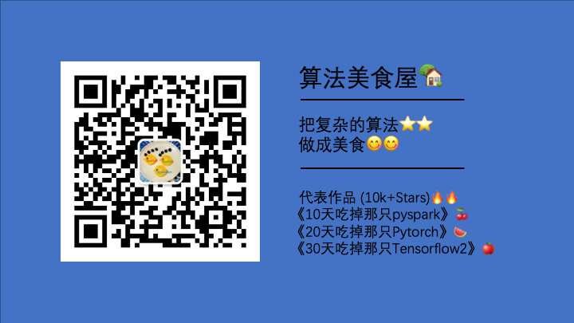

# 30分钟学会shapely空间几何分析


shapely是python中开源的空间几何对象库，支持Point(点)，LineString(线)，Polygon(面)等几何对象及相关空间操作。

实践证明，它的以下一些功能特性非常常用：

* 几何对象可以和numpy.array互相转换。

* 可以轻松求线的长度(length)，面的面积（area)，对象之间的距离(distance),最小最大距离(hausdorff_distance)。

* 可以轻松求几何对象之间的关系：相交(intersect)，包含(contain)，求相交区域(intersection)等。

* 可以轻松对几何对象求几何中心(centroid),缓冲区(buffer),最小旋转外接矩形(minimum_rotated_rectangle)等。

* 可以求线的插值点(interpolate),可以求点投影到线的距离(project),可以求几何对象之间对应的最近点(nearestPoint)

* 可以轻松对几何对象进行旋转(rotate)和缩放(scale)。


```python
#安装shapely
!pip install shapely 
```

```python
from shapely import geometry as geo
from shapely import wkt 
from shapely import ops
import numpy as np 

```

### 一，Point对象

```python
# 创建Point对象
pt1 = geo.Point([0,0])
print(pt1) 
coord = np.array([0,1])
pt2 = geo.Point(coord)
print(pt2)
pt3 = wkt.loads("POINT(1 1)")
print(pt3)

#批量可视化
geo.GeometryCollection([pt1,pt2,pt3])
```

```python

```

```python
# 常用属性

print(pt1.x) 
print(pt1.y)
print(list(pt1.coords))  
print(np.array(pt1)) #可以和np.array互转

```

```python
# 常用方法

d = pt2.distance(pt1)
print(d)


```

### 二, LineString对象

```python
# 创建LineString对象
line1 = geo.LineString([(0,0),(1,-0.1),(2,0.1),(3,-0.1),(5,0.1),(7,0)])
line1 
```

```python

```

```python
arr = np.array([(2,2),(3,2),(4,3)])
line2 = geo.LineString(arr)
line2 
```

```python

```

```python
line3 = wkt.loads("LineString(-2 -2,4 4)")
line3 
```

```python

```

```python
# 常用属性
print(line2.length) 
print(list(line2.coords)) 
print(np.array(line2))  #可以和np.array互转
print(line2.bounds) #坐标范围
```

```python
center = line2.centroid #几何中心
geo.GeometryCollection([line2,center])
```

```python

```

```python
bbox = line2.envelope #最小外接矩形
geo.GeometryCollection([line2,bbox]) 
```

```python

```

```python
rect = line2.minimum_rotated_rectangle #最小旋转外接矩形
geo.GeometryCollection([line2,rect])
```

```python

```

```python
# 常用方法

d1 = line1.distance(line2) #线线距离
print(d1)
d2 = line1.distance(geo.Point([-1,0])) #线点距离
print(d2)
d3 = line1.hausdorff_distance(line2) #最小最大距离
print(d3)

```

```python
pt_half = line1.interpolate(0.5,normalized=True) #插值
geo.GeometryCollection([line1,pt_half])
```

```python

```

```python
ratio = line1.project(pt_half,normalized=True) #投影
print(ratio)
```

```python
line1_simplify = line1.simplify(0.5)  #化简 DouglasPucker算法
print(line1)
print(line1_simplify)
line1_simplify 
```

```python

```

```python
buffer_with_circle = line2.buffer(0.2)  #端点按照半圆扩展
geo.GeometryCollection([line2,buffer_with_circle])
```

```python

```

```python
buffer_without_circle = line2.buffer(0.2,cap_style=2) #端点不扩展
geo.GeometryCollection([line2,buffer_without_circle])

```

```python

```

```python
buffer_with_square = line2.buffer(0.2,cap_style=3) #端点按照方形扩展
geo.GeometryCollection([line2,buffer_with_square])

```

```python

```

```python
buffer_round_join = line2.buffer(0.2,join_style=1) #圆弧连接
geo.GeometryCollection([line2,buffer_round_join])
```

```python

```

```python
buffer_angle_join = line2.buffer(0.2,join_style=2) #折角连接
geo.GeometryCollection([line2,buffer_angle_join])
```

```python

```

```python
print(line2.intersects(line3)) #线线关系，是否相交
print(line2.intersection(line3)) #线线交点
print(line2.contains(geo.Point(2.5,2))) #点线关系
```

### 三，Polygon对象


```python
# 创建Polygon对象
poly1 = geo.Polygon([(0,0),(1,0),(1,1),(0,1),(0,0)]) #起点和终点相同
poly1

```

```python

```

```python
coords = np.array([(0,0),(1,0.1),(2,0),(1,2),(0,0)])
poly2 = geo.Polygon(coords)
poly2 
```

```python

```

```python
#第一个括号是外部坐标，后面的是内部空洞坐标
poly3 = wkt.loads("POLYGON((0 0,2 0,2 2,0 2,0 0),(0.5 0.5,1.5 0.5,1.5 1.5,0.5 1.5,0.5 0.5))")
poly3 

```

```python

```

```python
#创建bbox对象
poly4 = geo.Polygon.from_bounds(xmin=0,ymin=0,xmax=20,ymax=20)
poly4 
```

```python

```

```python
#常用属性
print(poly1.area)  #面积
print(poly1.length) #周长
print(np.array(poly1.exterior))  #外围坐标点
print(poly3.bounds) #坐标范围
```

```python

```

```python
center = poly3.centroid #几何中心
geo.GeometryCollection([center,poly3]) 

```

```python

```

```python
poly3.boundary #边缘
```

```python

```

```python

rect = poly2.minimum_rotated_rectangle #最小外接矩形
geo.GeometryCollection([rect,poly2])

```

```python

```

```python
# 常用方法
r1 = poly2.contains(geo.Point(0,0)) #面点关系
print(r1)

r2 = poly2.intersects(geo.LineString([(0,0),(5,5)])) #面线关系
print(r2)

r3 = poly2.intersects(poly3) #面面关系
print(r3)
```

```python

```

```python
geo.GeometryCollection([poly1,line3])
```

```python

```

```python
inter = poly1.intersection(line3) #面线交集
geo.GeometryCollection([poly1,inter])
```

```python

```

```python
geo.GeometryCollection([poly1,poly2])
```

```python

```

```python
poly1.intersection(poly2) #面面交集
```

```python

```

```python
poly1.union(poly2) #面面并集
```

```python

```

```python
poly2.difference(poly1) #面面补集
```

```python

```

```python
poly2.simplify(0.5) #简化
```

```python

```

```python
print(poly2.area)
poly2_bigger = poly2.buffer(0.2) #外扩面积变大
print(poly2_bigger.area)
poly2_smaller = poly2.buffer(-0.2) #内扩面积变小
print(poly2_smaller.area)
poly2_smaller 
```

```python

```

```python

```

### 四，其他几何对象

```python
# MultiPoint 多点

x = np.linspace(0,2*np.pi,10)
y = np.sin(x)
points = [geo.Point(i,j) for i,j in zip(x,y)]
multipoints = geo.MultiPoint(points ) 
multipoints

```

```python

```

```python
hull = multipoints.convex_hull  #凸包
geo.GeometryCollection([hull,multipoints]) 
```

```python

```

```python

```

```python
# MultiLineString 多线
multilines = geo.MultiLineString([line1,line2])
multilines 
```

```python

```

```python
# MultiPolygon 多面

multipolys = geo.MultiPolygon([poly1,poly2])
multipolys 
```

```python

```

```python
# GeometryCollection 对象集合

geoms = [pt1,pt2,pt3,line3,poly3]
geo.GeometryCollection(geoms) #方便在jupyter 中对多个几何对象可视化

```

```python

```

### 五，进阶操作


以下是一些非常有用但是不属于某个类的方法的函数。

* ops.nearest_points 求最近点

* ops.split 分割线

* ops.substring  求子串

* affinity.rotate 旋转几何体

* affinity.scale 缩放几何体

* affinity.translate 平移几何体


```python
from shapely import ops,affinity 

poly1 = geo.Polygon([(0,0),(2,0),(1,1),(0,0)])
poly2 = geo.Polygon([(4,0),(6,0),(6,2),(4,2),(4,0)])

p1,p2 = ops.nearest_points(poly1,poly2)

geo.GeometryCollection([poly1,poly2,p1,p2]) 
```

```python

```

```python
poly1_rot30 = affinity.rotate(poly1,30,origin = "centroid")
geo.GeometryCollection([poly1,poly1_rot30])

```

```python

```

```python
poly1_scale = affinity.scale(poly1,xfact=2.0,yfact=2.0)

geo.GeometryCollection([poly1,poly1_scale])
```

如果对本文内容理解上有需要进一步和作者交流的地方，欢迎在公众号"算法美食屋"下留言。作者时间和精力有限，会酌情予以回复。

也可以在公众号后台回复关键字：加群，加入读者交流群和大家讨论。


