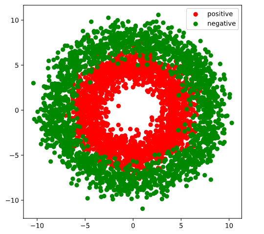
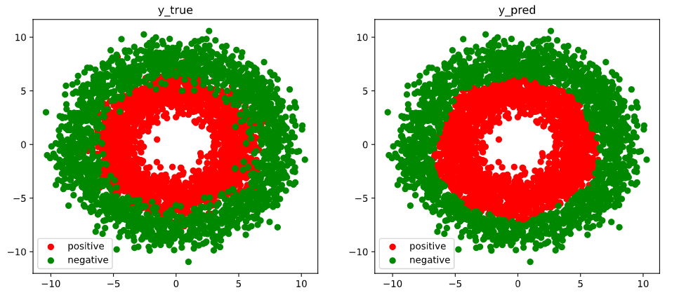
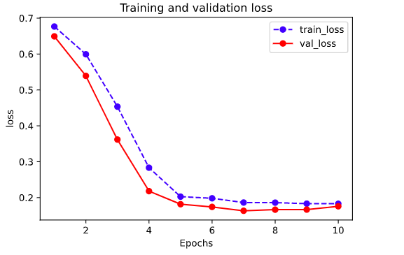
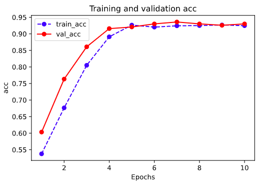

# 像 Keras 一样优雅地使用 pytorch-lightning


你好，我是云哥。本篇文章为大家介绍一个可以帮助大家优雅地进行深度学习研究的工具：pytorch-lightning。

pytorch-lightning 是建立在pytorch之上的高层次模型接口，pytorch-lightning之于pytorch,就如同keras之于tensorflow。

关于pytorch-lightning的完整入门介绍，可以参考我的另外一篇文章。

笔者用了约80行代码对 pytorch-lightning 做了进一步封装，使得对它不熟悉的用户可以用类似Keras的风格使用它，轻而易举地实现如下功能：

* 模型训练（cpu,gpu,多GPU）

* 模型评估 (自定义评估指标)

* 最优模型参数保存（ModelCheckPoint）

* 自定义学习率 (lr_schedule)

* 画出优美的Loss和Metric曲线

它甚至会比Keras还要更加简单和好用一些。

这个封装的类 LightModel 添加到了我的开源仓库 torchkeras 中，用户可以用pip进行安装。

```
pip install -U torchkeras
```

以下是一个通过LightModel使用DNN模型进行二分类的完整范例。😋😋

在本例的最后，云哥将像大家表演一个"金蝉脱壳"的绝技。不要离开。


```python
import numpy as np 
import pandas as pd 
from matplotlib import pyplot as plt
import torch
from torch import nn
import torch.nn.functional as F
from torch.utils.data import Dataset,DataLoader,TensorDataset
import datetime

#attention these two lines
import pytorch_lightning as pl 
import torchkeras 

```

### 一，准备数据

```python
%matplotlib inline
%config InlineBackend.figure_format = 'svg'

#number of samples
n_positive,n_negative = 2000,2000

#positive samples
r_p = 5.0 + torch.normal(0.0,1.0,size = [n_positive,1]) 
theta_p = 2*np.pi*torch.rand([n_positive,1])
Xp = torch.cat([r_p*torch.cos(theta_p),r_p*torch.sin(theta_p)],axis = 1)
Yp = torch.ones_like(r_p)

#negative samples
r_n = 8.0 + torch.normal(0.0,1.0,size = [n_negative,1]) 
theta_n = 2*np.pi*torch.rand([n_negative,1])
Xn = torch.cat([r_n*torch.cos(theta_n),r_n*torch.sin(theta_n)],axis = 1)
Yn = torch.zeros_like(r_n)

#concat positive and negative samples
X = torch.cat([Xp,Xn],axis = 0)
Y = torch.cat([Yp,Yn],axis = 0)


#visual samples
plt.figure(figsize = (6,6))
plt.scatter(Xp[:,0],Xp[:,1],c = "r")
plt.scatter(Xn[:,0],Xn[:,1],c = "g")
plt.legend(["positive","negative"]);


```




```python
# split samples into train and valid data.
ds = TensorDataset(X,Y)
ds_train,ds_valid = torch.utils.data.random_split(ds,[int(len(ds)*0.7),len(ds)-int(len(ds)*0.7)])
dl_train = DataLoader(ds_train,batch_size = 100,shuffle=True,num_workers=4)
dl_valid = DataLoader(ds_valid,batch_size = 100,num_workers=4)

```

```python

```

### 二，定义模型

```python
#define the network like torch
class Net(nn.Module):  
    def __init__(self):
        super().__init__()
        self.fc1 = nn.Linear(2,6)
        self.fc2 = nn.Linear(6,12) 
        self.fc3 = nn.Linear(12,1)
        
    def forward(self,x):
        x = F.relu(self.fc1(x))
        x = F.relu(self.fc2(x))
        y = nn.Sigmoid()(self.fc3(x))
        return y       
```

```python
class Model(torchkeras.LightModel):
    def shared_step(self,batch):
        x, y = batch
        prediction = self(x)
        loss = nn.BCELoss()(prediction,y)
        preds = torch.where(prediction>0.5,torch.ones_like(prediction),torch.zeros_like(prediction))
        acc = pl.metrics.functional.accuracy(preds, y)
        # attention: there must be a key of "loss" in the returned dict 
        dic = {"loss":loss,"acc":acc} 
        return dic
    
    #optimizer,and optional lr_scheduler
    def configure_optimizers(self):
        optimizer = torch.optim.Adam(self.parameters(), lr=1e-2)
        lr_scheduler = torch.optim.lr_scheduler.StepLR(optimizer, step_size=10, gamma=0.0001)
        return {"optimizer":optimizer,"lr_scheduler":lr_scheduler}
 
```

注意，下面我们把网络结构net包装在一个model的壳之中。😝😝

```python
pl.seed_everything(123)

# we wrap the network into a Model 
net = Net()
model = Model(net)

torchkeras.summary(model,input_shape =(2,))

```

```
----------------------------------------------------------------
        Layer (type)               Output Shape         Param #
================================================================
            Linear-1                    [-1, 4]              12
            Linear-2                    [-1, 8]              40
            Linear-3                    [-1, 1]               9
================================================================
Total params: 61
Trainable params: 61
Non-trainable params: 0
----------------------------------------------------------------
Input size (MB): 0.000008
Forward/backward pass size (MB): 0.000099
Params size (MB): 0.000233
Estimated Total Size (MB): 0.000340
----------------------------------------------------------------
```


### 三，训练模型

```python

ckpt_callback = pl.callbacks.ModelCheckpoint(
    monitor='val_loss',
    save_top_k=1,
    mode='min'
)

# gpus=0 则使用cpu训练，gpus=1则使用1个gpu训练，gpus=2则使用2个gpu训练，gpus=-1则使用所有gpu训练，
# gpus=[0,1]则指定使用0号和1号gpu训练， gpus="0,1,2,3"则使用0,1,2,3号gpu训练
# tpus=1 则使用1个tpu训练

trainer = pl.Trainer(max_epochs=10,gpus=0,callbacks = [ckpt_callback]) 

#断点续训
#trainer = pl.Trainer(resume_from_checkpoint='./lightning_logs/version_31/checkpoints/epoch=02-val_loss=0.05.ckpt')

trainer.fit(model,dl_train,dl_valid)
```

```
GPU available: False, used: False
TPU available: None, using: 0 TPU cores

  | Name | Type | Params
------------------------------
0 | net  | Net  | 115   
------------------------------
115       Trainable params
0         Non-trainable params
115       Total params

================================================================================2021-01-24 20:47:39
epoch =  0
{'val_loss': 0.6492899060249329, 'val_acc': 0.6033333539962769}
{'acc': 0.5374999642372131, 'loss': 0.6766871809959412}

================================================================================2021-01-24 20:47:40
epoch =  1
{'val_loss': 0.5390750765800476, 'val_acc': 0.763333261013031}
{'acc': 0.676428496837616, 'loss': 0.5993633270263672}

================================================================================2021-01-24 20:47:41
epoch =  2
{'val_loss': 0.3617284595966339, 'val_acc': 0.8608333468437195}
{'acc': 0.8050000071525574, 'loss': 0.4533742070198059}

================================================================================2021-01-24 20:47:42
epoch =  3
{'val_loss': 0.21798092126846313, 'val_acc': 0.9158334732055664}
{'acc': 0.8910714387893677, 'loss': 0.28334707021713257}

================================================================================2021-01-24 20:47:43
epoch =  4
{'val_loss': 0.18157465755939484, 'val_acc': 0.9208333492279053}
{'acc': 0.926428496837616, 'loss': 0.20261192321777344}

================================================================================2021-01-24 20:47:44
epoch =  5
{'val_loss': 0.17406059801578522, 'val_acc': 0.9300000071525574}
{'acc': 0.9203571677207947, 'loss': 0.1980973333120346}

================================================================================2021-01-24 20:47:45
epoch =  6
{'val_loss': 0.16323940455913544, 'val_acc': 0.935833215713501}
{'acc': 0.9242857694625854, 'loss': 0.1862144023180008}

================================================================================2021-01-24 20:47:46
epoch =  7
{'val_loss': 0.16635416448116302, 'val_acc': 0.9300000071525574}
{'acc': 0.925000011920929, 'loss': 0.18595384061336517}

================================================================================2021-01-24 20:47:47
epoch =  8
{'val_loss': 0.1665605753660202, 'val_acc': 0.9258332848548889}
{'acc': 0.9267856478691101, 'loss': 0.18308643996715546}

================================================================================2021-01-24 20:47:48
epoch =  9
{'val_loss': 0.1757962554693222, 'val_acc': 0.9300000071525574}
{'acc': 0.9246429204940796, 'loss': 0.18282662332057953}
```

```python
# visual the results
fig, (ax1,ax2) = plt.subplots(nrows=1,ncols=2,figsize = (12,5))
ax1.scatter(Xp[:,0],Xp[:,1], c="r")
ax1.scatter(Xn[:,0],Xn[:,1],c = "g")
ax1.legend(["positive","negative"]);
ax1.set_title("y_true")

Xp_pred = X[torch.squeeze(model.forward(X)>=0.5)]
Xn_pred = X[torch.squeeze(model.forward(X)<0.5)]

ax2.scatter(Xp_pred[:,0],Xp_pred[:,1],c = "r")
ax2.scatter(Xn_pred[:,0],Xn_pred[:,1],c = "g")
ax2.legend(["positive","negative"]);
ax2.set_title("y_pred")

```




```python

```

### 四，评估模型

```python
import pandas as pd 

history = model.history
dfhistory = pd.DataFrame(history) 
dfhistory 
```

```python
%matplotlib inline
%config InlineBackend.figure_format = 'svg'

import matplotlib.pyplot as plt

def plot_metric(dfhistory, metric):
    train_metrics = dfhistory[metric]
    val_metrics = dfhistory['val_'+metric]
    epochs = range(1, len(train_metrics) + 1)
    plt.plot(epochs, train_metrics, 'bo--')
    plt.plot(epochs, val_metrics, 'ro-')
    plt.title('Training and validation '+ metric)
    plt.xlabel("Epochs")
    plt.ylabel(metric)
    plt.legend(["train_"+metric, 'val_'+metric])
    plt.show()
    
```

```python
plot_metric(dfhistory,"loss")
```



```python
plot_metric(dfhistory,"acc")
```



```python

results = trainer.test(model, test_dataloaders=dl_valid, verbose = False)
print(results[0])

```

```
{'test_loss': 0.15939873456954956, 'test_acc': 0.9599999785423279}
```

```python

```

### 五，使用模型

```python
def predict(model,dl):
    model.eval()
    result = torch.cat([model.forward(t[0].to(model.device)) for t in dl])
    return(result.data)

result = predict(model,dl_valid)

```

```python
result 
```

```
tensor([[9.8850e-01],
        [2.3642e-03],
        [1.2128e-04],
        ...,
        [9.9002e-01],
        [9.6689e-01],
        [1.5238e-02]])
```

```python

```

### 六，保存模型


最优模型默认保存在 trainer.checkpoint_callback.best_model_path 的目录下，可以直接加载。

```python
print(trainer.checkpoint_callback.best_model_path)
print(trainer.checkpoint_callback.best_model_score)
```

```python
model_clone = Model.load_from_checkpoint(trainer.checkpoint_callback.best_model_path)
trainer_clone = pl.Trainer(max_epochs=10) 
results = trainer_clone.test(model_clone, test_dataloaders=dl_valid, verbose = False)
print(results[0])

```

```
{'test_loss': 0.20505842566490173, 'test_acc': 0.9399999976158142}
```


最后，给大家表演一个金蝉脱壳的绝技。😋😋

使用LightModel之壳训练后，可丢弃该躯壳，直接手动保存最优的网络结构net的权重。


```python
best_net = model.net 
torch.save(best_net.state_dict(),"best_net.pt")

#加载权重
net_clone = Net()
net_clone.load_state_dict(torch.load("best_net.pt"))


data,label = next(iter(dl_valid))
with torch.no_grad():
    preds  = model(data)
    preds_clone = net_clone(data)
    
print("model prediction:\n",preds[0:10],"\n")
print("net_clone prediction:\n",preds_clone[0:10])

```

```
model prediction:
 tensor([[9.8850e-01],
        [2.3642e-03],
        [1.2128e-04],
        [1.0022e-04],
        [9.3577e-01],
        [4.9769e-02],
        [9.8537e-01],
        [9.9940e-01],
        [4.1117e-04],
        [9.4009e-01]]) 

net_clone prediction:
 tensor([[9.8850e-01],
        [2.3642e-03],
        [1.2128e-04],
        [1.0022e-04],
        [9.3577e-01],
        [4.9769e-02],
        [9.8537e-01],
        [9.9940e-01],
        [4.1117e-04],
        [9.4009e-01]])
```

```python

```

如果对本文内容理解上有需要进一步和作者交流的地方，欢迎在公众号"算法美食屋"下留言。作者时间和精力有限，会酌情予以回复。

也可以在公众号后台回复关键字：加群，加入读者交流群和大家讨论。


